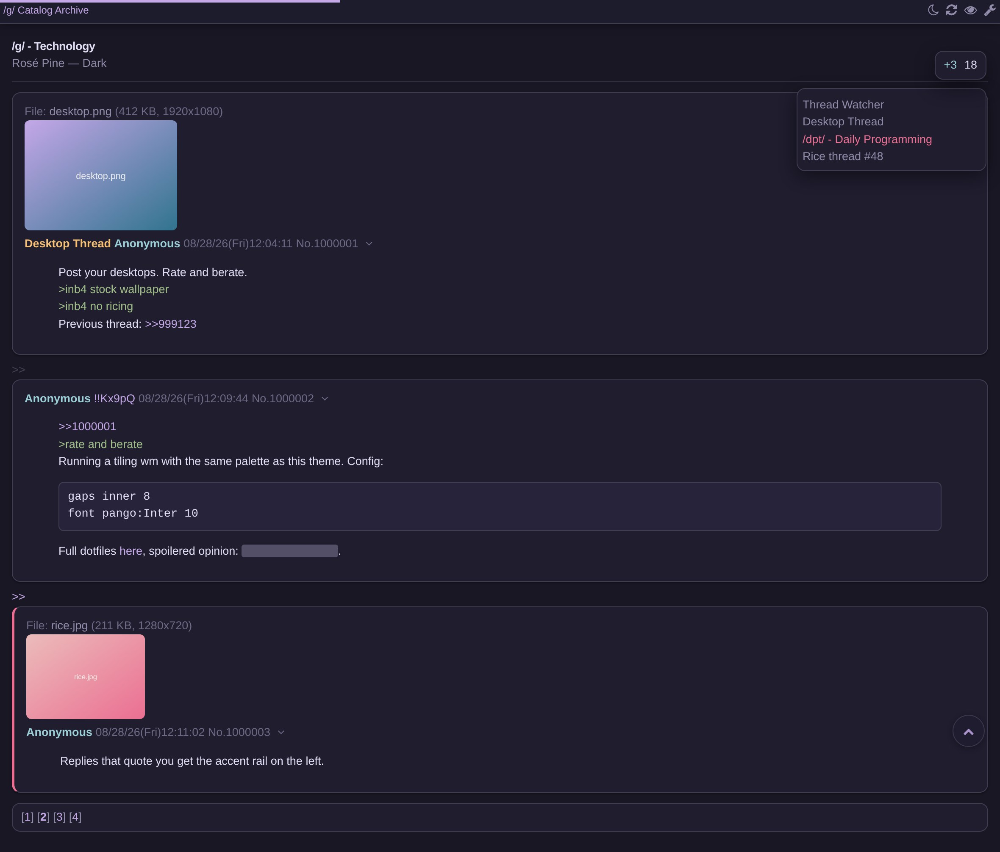

# Rose-chan
Rose-chan is a themed build of 4chan X. It puts [Rosé Pine](https://rosepinetheme.com/) on the board itself — Dawn (light) and Dark, using the upstream palette — and adds an optional motion layer, a set of appearance and navigation options, and a **Theme** tab in the settings panel. Everything else works the way 4chan X always has.

It is built on [4chan X](https://github.com/ccd0/4chan-x) by ccd0 ([4chan-x.net](https://www.4chan-x.net/)), from version 1.14.24.2. 4chan X is a script that adds various features to anonymous imageboards; it was originally developed for 4chan but has no affiliation with it, and neither does Rose-chan.

- Site and one-click install: https://daemon-404.github.io/rose-chan/
- Source code: https://github.com/DAEMON-404/rose-chan

## Install
1. Install [Violentmonkey](https://violentmonkey.github.io/) or [Tampermonkey](https://tampermonkey.net/).
2. Install **[the Rose-chan userscript](https://daemon-404.github.io/rose-chan/rose-chan.user.js)**. If the Pages site is unreachable, the [raw file](https://github.com/DAEMON-404/rose-chan/raw/master/docs/rose-chan.user.js) is the same build.
3. On any board, open `[Settings]` → the new **Theme** tab, and pick a theme.

Two things worth knowing before you install:

- **It replaces 4chan X rather than running beside it.** Rose-chan keeps 4chan X's script name and namespace unchanged on purpose, so your userscript manager installs it over any existing copy and your settings carry over untouched. Two copies of 4chan X running at once conflict, and 4chan X itself warns when it detects them. To go back to stock, reinstall from [4chan-x.net](https://www.4chan-x.net/builds/4chan-X.user.js); it replaces Rose-chan the same way, and your settings survive that trip too.
- **It does not check for updates.** The published file is the no-update build: its `@updateURL` and `@downloadURL` are `https://noupdate.invalid/`, so your manager never fetches anything on its own and cannot quietly swap Rose-chan for something else. To move to a newer build, reinstall from the link above.

The themes are off by default: until you pick one in the **Theme** tab, the board keeps 4chan X's own styling. Three additions are the exception — the motion layer, smooth scrolling and the back-to-top button are **on** from a fresh install and apply whether or not a theme is selected. Untick `Animations`, `Smooth Scrolling` and `Scroll to Top` in the same tab to get stock 4chan X's behaviour exactly. `prefers-reduced-motion` is honoured regardless, unless you override it.

## What it adds
- **Two Rosé Pine variants**, upstream palette, applied to the board itself — posts, greentext, quotes, files, code blocks, catalog and pagination — not just 4chan X's own dialogs. Dawn deviates in one place: its gold is too pale to read as text, so headings use a deepened gold. [The site](https://daemon-404.github.io/rose-chan/#palette) documents it.
- **Follow the system light/dark setting**, plus a header shortcut that flips between the variants.
- **An animation layer**: new posts fade in, menus and dialogs ease open, thumbnails and catalog cards lift on hover. Three speeds, and `prefers-reduced-motion` is honoured unless you override it.
- **Appearance options**: six accent colours, three density levels, square or rounded corners, a modern font stack, and optional background blur.
- **Navigation extras**: a back-to-top button, a reading progress bar, and smooth scrolling.

## Browser setup
Rose-chan installs like any other userscript. The notes below cover the managers and browsers 4chan X supports; every install link in them points at the Rose-chan build.

### Firefox
Install [Violentmonkey](https://addons.mozilla.org/en-US/firefox/addon/violentmonkey/), [Tampermonkey](https://addons.mozilla.org/en-US/firefox/addon/tampermonkey/), or [Greasemonkey](https://addons.mozilla.org/en-US/firefox/addon/greasemonkey/) (issues since v4: [#2526](https://github.com/greasemonkey/greasemonkey/issues/2526), [#2576](https://github.com/greasemonkey/greasemonkey/issues/2574)), then **[click here to install Rose-chan](https://daemon-404.github.io/rose-chan/rose-chan.user.js)**.

Ports of Greasemonkey are available for [SeaMonkey](https://sourceforge.net/projects/gmport/) and [Pale Moon](https://github.com/janekptacijarabaci/greasemonkey/releases/latest).

### Chromium
Install [Violentmonkey](https://chrome.google.com/webstore/detail/violent-monkey/jinjaccalgkegednnccohejagnlnfdag) or [Tampermonkey](https://tampermonkey.net/), then **[click here to install Rose-chan](https://daemon-404.github.io/rose-chan/rose-chan.user.js)**.

### Safari
Install the [Userscripts](https://itunes.apple.com/us/app/userscripts/id1463298887) extension. Enable it by pressing `⌘,`, navigating to the extensions pane and checking the `Userscripts` checkbox. Now open the Userscripts editor by clicking on the `</>` button in the taskbar. Then click on the `+` button and select the `New Javascript` option. Replace the default text with the contents of the Rose-chan **[script](https://daemon-404.github.io/rose-chan/rose-chan.user.js)**. Finally save it by pressing `⌘s`.

### WebKitGTK+ / QtWebKit / QtWebEngine
Several minimal browsers have support for userscripts and can run Rose-chan. Due to the lack of the cross-site GM_* API, and lack of support for userscripts in iframes, not all features will work. You may experience crashes when repeatedly solving the default image-based captchas. You can avoid this problem by enabling `Use Recaptcha v1` in your settings.

- **dwb**: Install the userscripts extension, then save the [script](https://daemon-404.github.io/rose-chan/rose-chan.user.js) to the `$XDG_CONFIG_HOME/dwb/greasemonkey` or `$HOME/.config/dwb/greasemonkey` directory (creating it if necessary):

  ```
  dwbem -N -i userscripts
  wget -P ${XDG_CONFIG_HOME:-$HOME/.config}/dwb/greasemonkey https://daemon-404.github.io/rose-chan/rose-chan.user.js
  ```

- **Midori**: Enable `User addons` in your preferences, under the Extensions tab. In the Privacy tab, check `Enable HTML5 local storage support`. Optionally, if you want Rose-chan to be able to open new tabs when you start or reply to a thread, you will need to check `Allow scripts to open popups` under the Behavior tab. Then click the link to the [script](https://daemon-404.github.io/rose-chan/rose-chan.user.js) to install it.

- **Luakit**: Navigate to the [script](https://daemon-404.github.io/rose-chan/rose-chan.user.js), then type the command `:usi` to install it.

- **uzbl**: Install the script from https://github.com/singpolyma/singpolyma/blob/master/uzbl/data/scripts/userscript.sh, enable it in your config file, and then save [Rose-chan](https://daemon-404.github.io/rose-chan/rose-chan.user.js) to `$XDG_DATA_HOME/uzbl/userscripts` (or `$HOME/.local/share/uzbl/userscripts`). The commands below assume you have run uzbl at least once to create its config file.

  ```
  wget -P "${XDG_DATA_HOME:-$HOME/.local/share}/uzbl/scripts" https://raw.githubusercontent.com/singpolyma/singpolyma/master/uzbl/data/scripts/userscript.sh
  chmod +x "${XDG_DATA_HOME:-$HOME/.local/share}/uzbl/scripts/userscript.sh"
  echo '@on_event LOAD_COMMIT spawn @scripts_dir/userscript.sh document-start' >> "${XDG_CONFIG_HOME:-$HOME/.config}/uzbl/config"
  echo '@on_event LOAD_FINISH spawn @scripts_dir/userscript.sh document-end'   >> "${XDG_CONFIG_HOME:-$HOME/.config}/uzbl/config"
  wget -P "${XDG_DATA_HOME:-$HOME/.local/share}/uzbl/userscripts" https://daemon-404.github.io/rose-chan/rose-chan.user.js
  ```

- **qutebrowser**: Save the [script](https://daemon-404.github.io/rose-chan/rose-chan.user.js) to the `$XDG_DATA_HOME/qutebrowser/greasemonkey` or `$HOME/.local/share/qutebrowser/greasemonkey` directory:

  ```
  wget -P ${XDG_DATA_HOME:-$HOME/.local/share}/qutebrowser/greasemonkey https://daemon-404.github.io/rose-chan/rose-chan.user.js
  ```

### MS Edge
Install [Tampermonkey](https://www.microsoft.com/en-us/store/p/tampermonkey/9nblggh5162s), then **[click here to install Rose-chan](https://daemon-404.github.io/rose-chan/rose-chan.user.js)**.

### Other browsers
Rose-chan can be used in some browsers that do not support userscripts using [a local proxy](https://github.com/ccd0/4chan-x-proxy), an upstream tool by ccd0. Not all features will work.

## Please note
**Uninstalling**: Rose-chan disables the native extension, so if you uninstall Rose-chan, you'll need to re-enable it. To do this, click the `[Settings]` link in the top right corner, uncheck "`Disable the native extension`" in the panel that appears, and click the "`Save Settings`" button. If you don't see a "`Save Settings`" button, it may be being hidden by your ad blocker.

**Private browsing**: By default, Rose-chan remembers your last read post in a thread and which posts were made by you, even if you are in private browsing / incognito mode. If you want to turn this off, uncheck the `Remember Last Read Post` and `Remember Your Posts` options in the settings panel. You can clear all 4chan browsing history saved by Rose-chan by resetting your settings.

Use of the "Link Title" feature to fetch titles of Youtube links is subject to Youtube's [Terms of Service](https://www.youtube.com/t/terms) and [Privacy Policy](http://www.google.com/policies/privacy). For more details on what information is sent to Youtube and other sites, and how to turn it off if you don't want the feature, see upstream 4chan X's [privacy documentation](https://github.com/ccd0/4chan-x/wiki/Privacy), which describes this build's behaviour as well.

## Built on 4chan X
Rose-chan is built on [4chan X](https://github.com/ccd0/4chan-x) by ccd0, whose home is [4chan-x.net](https://www.4chan-x.net/). Almost all of the code here is theirs: the features, the settings panel Rose-chan plugs a tab into, the imageboard handling, the build system. Anything Rose-chan does not claim in **What it adds** above is 4chan X's work.

4chan X was previously developed by [aeosynth](https://github.com/aeosynth/4chan-x), [Mayhem](https://github.com/MayhemYDG/4chan-x), [ihavenoface](https://github.com/ihavenoface/4chan-x), [Zixaphir](https://github.com/zixaphir/appchan-x), [Seaweed](https://github.com/seaweedchan/4chan-x), and [Spittie](https://github.com/Spittie/4chan-x), with contributions from many others.

Rose-chan is distributed under the MIT licence, the same terms as 4chan X. [LICENSE](https://github.com/DAEMON-404/rose-chan/blob/master/LICENSE) adds a copyright line for Rose-chan's own additions and carries every upstream copyright notice below it, unchanged.

ccd0 and the other 4chan X contributors have no involvement in Rose-chan and do not endorse it. It is an independent project that happens to be built on their work.

Bugs go to whichever project owns them:

- **Reproduces on stock 4chan X** — that is an upstream bug. Follow the steps in upstream's [reporting guide](https://github.com/ccd0/4chan-x/blob/master/CONTRIBUTING.md#reporting-bugs) and report it to the [4chan X issue tracker](https://github.com/ccd0/4chan-x/issues), against stock 4chan X rather than Rose-chan.
- **Only happens with a Rose-chan theme applied, in the Theme tab, or with the motion layer on** — that is ours. Report it to the [Rose-chan issue tracker](https://github.com/DAEMON-404/rose-chan/issues).

## Building from source
```
npm install
make
```

The build writes to `testbuilds/`; `testbuilds/4chan-X-noupdate.user.js` is the file published as `docs/rose-chan.user.js`.

## Troubleshooting
First work out which project the bug belongs to. Set the theme back to `None` in the Theme tab and uncheck `Enable animations`, or reinstall stock 4chan X from [4chan-x.net](https://www.4chan-x.net/builds/4chan-X.user.js), and see whether the problem is still there.

- **Still there without Rose-chan's theming**: it is an upstream bug. Try the steps [here](https://github.com/ccd0/4chan-x/blob/master/CONTRIBUTING.md#reporting-bugs), then report it to the [4chan X issue tracker](https://github.com/ccd0/4chan-x/issues?q=is%3Aopen+sort%3Aupdated-desc). If a script update seems to have caused it, older builds are linked from 4chan X's [changelog](https://github.com/ccd0/4chan-x/blob/master/CHANGELOG.md). ccd0 can also be reached in the [4chan X thread on Kissu](https://kissu.moe/maho/res/40); that is a contact for upstream, not for Rose-chan.
- **Only with Rose-chan**: report it to the [Rose-chan issue tracker](https://github.com/DAEMON-404/rose-chan/issues). Say which browser and userscript manager you use, which theme was active, and whether the motion layer was on. Back up your settings regularly so a bug cannot take them with it.

## More information
**Rose-chan**

- [Site](https://daemon-404.github.io/rose-chan/)
- [Source code](https://github.com/DAEMON-404/rose-chan)
- [Report bugs](https://github.com/DAEMON-404/rose-chan/issues)
- [Changelog](https://github.com/DAEMON-404/rose-chan/blob/master/CHANGELOG.md)

**4chan X (upstream)**

- [Changelog](https://github.com/ccd0/4chan-x/blob/master/CHANGELOG.md)
- [Frequently Asked Questions](https://github.com/ccd0/4chan-x/wiki/Frequently-Asked-Questions)
- [Privacy](https://github.com/ccd0/4chan-x/wiki/Privacy)
- [Report Bugs](https://github.com/ccd0/4chan-x/issues)
- [Contributing](https://github.com/ccd0/4chan-x/blob/master/CONTRIBUTING.md)
- [Beta channel](https://www.4chan-x.net/builds/4chan-X-beta.user.js) — upstream's testing build. It is stock 4chan X, not a Rose-chan build, and installing it replaces Rose-chan.
- [OneeChan](https://github.com/KevinParnell/OneeChan) — a maintained fork of OneeChan, a style script used in addition to 4chan X.
